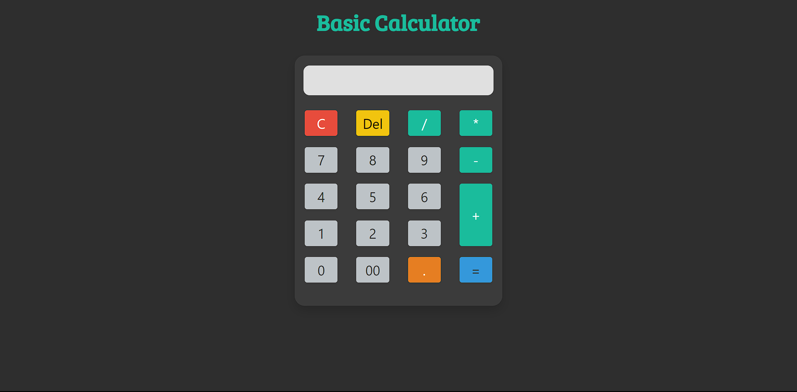

Basic Calculator

Project Description:
This basic calculator is implemented using HTML, CSS, and JavaScript. It enables users to perform arithmetic operations such as addition, subtraction, multiplication, and division. The calculator features a user-friendly interface with buttons for numeric input, operators, and special functions like clearing the display and calculating results.

File Structure:

Index.html: Contains the structure and layout of the calculator.

Styles.css: Defines the styles and appearance of the calculator interface.

Scripts.js: Implements the calculator's functionality using JavaScript.

Technologies Used:

HTML

CSS

JavaScript

Bootstrap 4 (for adjusting layout)

Google Fonts (Bree Serif, Roboto)

Features:

User Interface: Designed with a clean and responsive layout suitable for various screen sizes.

Operations: Supports basic arithmetic operations (+, -, *, /).

Special Buttons: Includes buttons for clearing the display ("C"), deleting the last character ("Del"), and calculating results ("=").

Error Handling: Gracefully manages mathematical errors such as division by zero.

Additional Interactions:

Keyboard Support: Users can interact with the calculator using the keyboard.

Numbers (0-9): Input numbers directly from the keyboard.

*Operators (+, -, , /): Basic operators can be used from the keyboard.

Characters ('.', C):
'.' (dot) for decimals.

'C' to clear the display.

Keys (Enter, Backspace, Delete):

'Enter' to get results.

'Backspace' and 'Delete' to delete the last digit entered.

Error Handling:

Division by Zero: If a user attempts to divide by zero, the calculator will display a custom message "Cannot divide by zero" instead of the default JavaScript error. This ensures a clear and user-friendly error notification.

General Error Handling: If the user inputs an invalid mathematical expression or an operation that results in an error, the calculator will display "Error + Error Message" to indicate the issue.

Usage:

Numeric Input: Click on numeric buttons (0-9) or use keyboard numbers to input values.

Operators: Use buttons or keyboard operators (+, -, *, /) to perform calculations.

Clearing Input: Press the "C" button or 'C' key to clear the display.

Deleting Input: Press the "Del" button, delete key, or backspace key to delete the last character.

Calculating Results: Press the "=" button or 'Enter' key to evaluate the expression and display the result.

Future Improvements:

Scientific Calculator Functions:

Expand Functionality: Add advanced mathematical operations like square roots, trigonometric functions (sine, cosine, tangent), logarithms, and exponential functions.

Enhanced Operators: Include functions for percentage calculations, factorials, and combinations.

User History:

History Panel: Implement a feature to display a history of recent calculations so users can review and reuse previous results.

Clear History: Add an option to clear the history list.

Custom Themes:

Theme Selection: Allow users to select from different themes or color schemes for the calculator to personalize their experience.

Dark Mode: Include a dark mode option for use in low-light environments.

Error Handling and Feedback:

Detailed Error Messages: Improve error handling to provide more specific feedback for invalid inputs or 
operations.

User Guidance: Offer suggestions or corrections when errors occur, such as invalid expressions or 
unsupported operations.

Screenshots:

How to Run:

1.Open the Repository Using Web Url:
https://github.com/hemanthh29/Basic-Calculator.git

2.Download Zip file

3.Open the Project in Your Browser:
Open index.html in your web browser to view and interact with the application.

Built by [Hemanth]